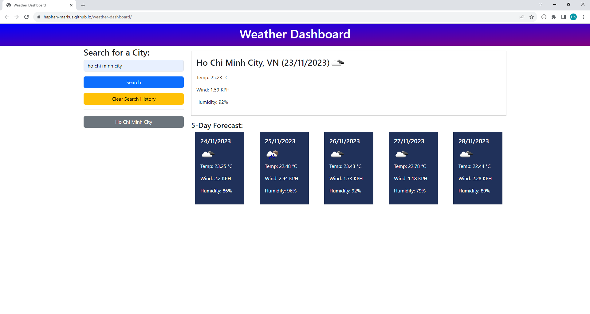
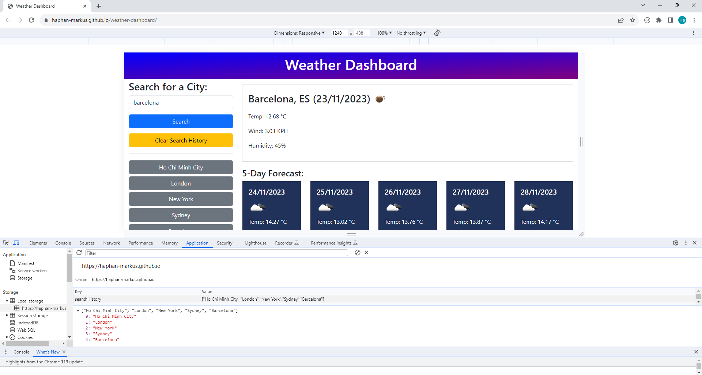
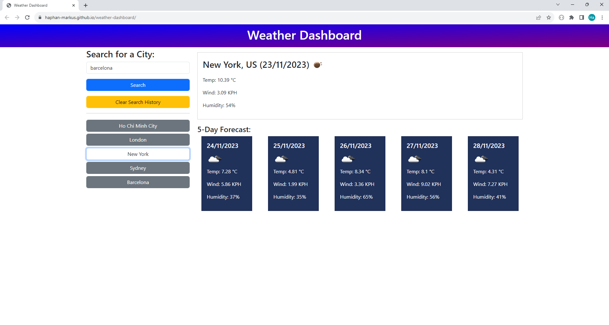

# Weather Dashboard

## Description

The weather dashboard allows the user to see the weather conditions of the current day and the forecase of next 5 days of the city they desire. The data presented in this website is provided by openweathermap API.

Upon entering the city name, the coordinates (latitude and longitude) will be automatically passed into the openweathermap API to pull the weather information.

## User Story

```
AS A traveler
I WANT to see the weather outlook for multiple cities
SO THAT I can plan a trip accordingly
```

## Usage

The deployed website link:

## Visual

The information about the temperature, wind, humidity and weather icon of the current day and the next 5 days of the search location are displayed on the interface:

The first search "Ho Chi Minh City":


Search for London weather:


Search for New York:


Search for Sydney:


Search for Barcelona:


All the searched locations are stored in the localstorage and new buttons for those destinations are displayed on the side of the interface:



When the buttons for each destination is clicked, the weather information will be displayed:



## License

[MIT](https://choosealicense.com/licenses/mit/)